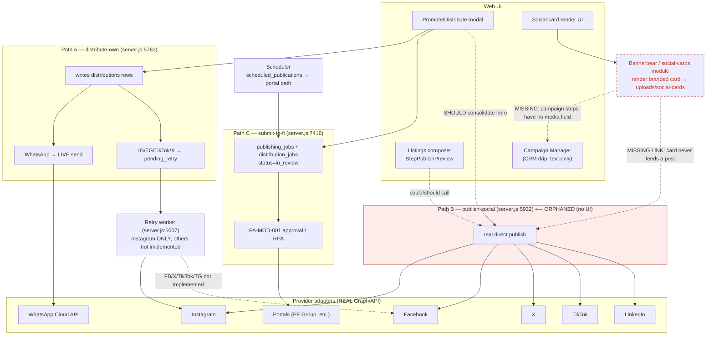
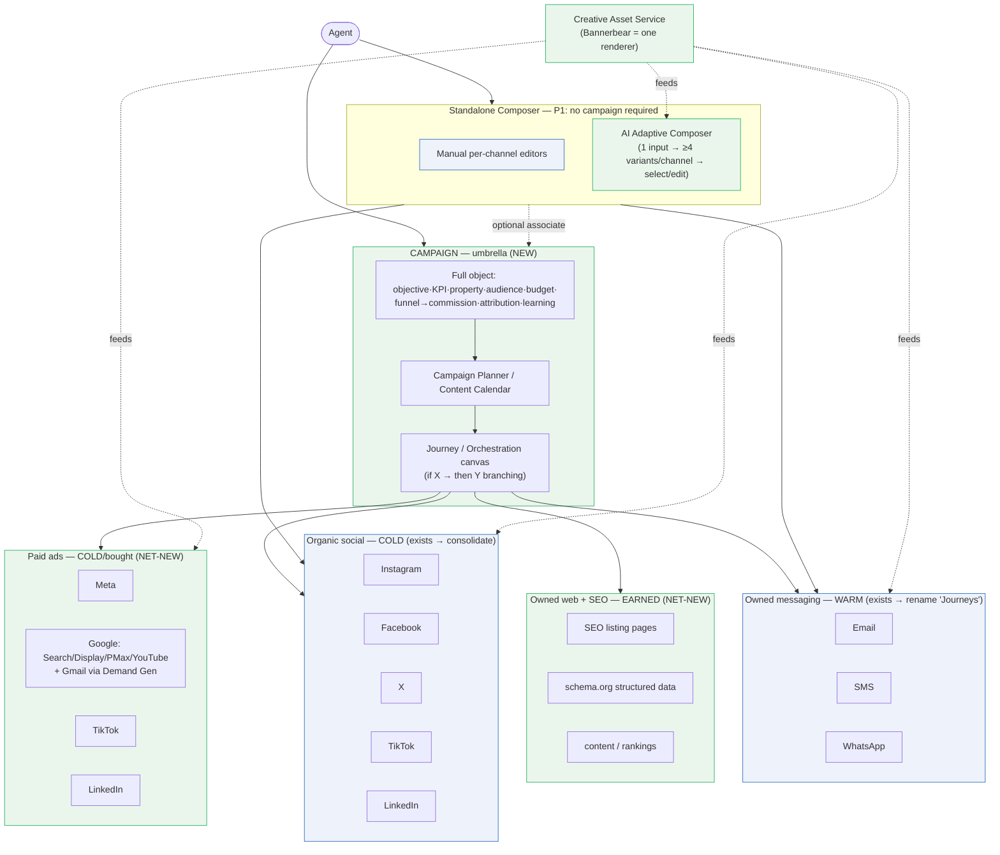
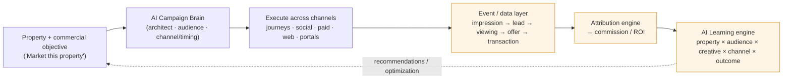

# Campaign Builder & Social Publishing — Reconciliation Decision Doc

**Status:** Draft for team review — **D0 & D0b ACCEPTED 2026-09-19** (umbrella model adopted; "campaign manager" → **Journeys**)
**Date:** 2026-09-19
**Scope:** Reconcile three overlapping "campaign / posting" areas; map the real state of organic social publishing; decide where Bannerbear plugs in; fence off paid ads as net-new.
**Related work:** PR #294 (AGT-CMP-003 Pro builder, landed), PR #302 (AGT-CMP-001 goal picker, skipped), PR #311 (AGT-CMP-002 wizard, blocked).

---

## TL;DR — the decisions we need to make

0. **✅ ACCEPTED — Adopt a campaign-centric orchestration model + rename.** In best-of-breed martech (HubSpot, Salesforce Marketing Cloud, Adobe Campaign, Braze), **"Campaign" is an umbrella** — a goal/audience/budget/dates/attribution container — and the channel executions sit *under* it. WingCaster today uses "campaign" to mean *only* the drip builder. **Decision (2026-09-19): promote "Campaign" to the umbrella; rename the drip builder to "Journeys."** The umbrella has two named surfaces: a **Campaign Planner** (calendar/plan of what goes out when, across channels) and a **Journey / Orchestration canvas** (the "if this → then that" conditional flow — e.g. *if no reply in 2 days → send WhatsApp*). Both confirmed in scope. See [Part 0](#part-0--the-three-layer-model-industry-alignment).
1. **The "campaign builder" is not social and not ads.** It is a CRM lead-nurture drip tool (email/WhatsApp/SMS to *existing contacts*) — i.e. the **Journey** layer, not the Campaign umbrella. #294 and #311 are two UX shapes of the **same** engine, not two domains. → Decide: **guided wizard for _create_, Pro single-page for _edit_** (recommended), or one supersedes the other.
2. **Organic social publishing already exists and is substantially real** — but it is fragmented across **three publish paths and three tables**, and the UI is wired to the weakest one. → Decide: **consolidate onto the real path (B), retire/merge the retry-queue path (A).**
3. **Bannerbear (branded social cards) is built but wired to nothing.** → Decide: promote it to a **shared "generate branded media" step** used by *both* social posting and the campaign manager.
4. **Paid ads (objectives / budget / targeting / guaranteed reach) do not exist.** → Decide: explicitly **out of scope for launch**, scoped as a net-new epic.

---

## Part 0 — Campaign-centric orchestration model (industry alignment)

> **Wording note (per external audit):** this is *a* campaign-centric model consistent with major enterprise martech patterns — **not** a single canonical "industry model." Vendors differ: Adobe distinguishes **Journeys** (individualized, stateful, event-driven), **Campaigns** (scheduled/batch or API-triggered), and **Orchestrated Campaigns** (complex batch orchestration). We adopt the umbrella + specialized-execution shape because it fits WingCaster's workflow, not because it is universal.

**What "campaign management" means in the industry.** In best-of-breed enterprise martech, a *Campaign* is not a single builder — it is an **umbrella** that groups a multi-channel, goal-oriented effort and rolls everything up to shared reporting/attribution. The channel-specific *authoring* happens in dedicated surfaces underneath it:

- **HubSpot** — "Campaigns" is a container associating emails, **social posts**, ads, landing pages, and workflows to one goal.
- **Salesforce Marketing Cloud** — Journey Builder (automation) + Social Studio (social) grouped under a Campaign object.
- **Adobe Campaign / Braze / Iterable** — cross-channel campaign/journey layer over per-channel execution.

So when a martech buyer hears "campaign manager," they expect social (and usually paid) to be **in scope** — as channels under the campaign, composed in their own modules, not merged into the email builder.

### How best-of-breed actually structures it (three concerns, not one form)

"Do they split channels *within* the campaign manager?" — resolved into three separable concerns:

1. **Planning + reporting = unified.** One Campaign object holds the goal, audience, budget, dates, and **attribution** across every channel. This is the umbrella.
2. **Authoring = always per-channel/specialized.** You compose an IG Reel in a social composer, an email in an email editor, a Google Search ad in an ad tool. Formats differ too much to share one form. (HubSpot, Salesforce MC, Adobe.)
3. **Orchestration = one surface, two flavors.** Either a **journey canvas** (Braze/Iterable/MC Journey Builder — drag channel nodes into one flow: email → wait → WhatsApp → …) **or** grouped one-shot executions under the campaign. Best-of-breed offers the canvas.

Net: **one umbrella + one orchestration surface + specialized editors underneath.** Never a monolithic all-channel form; never fully-siloed tools.

### The channel set is NOT homogeneous — four kinds

A common mistake is treating a "campaign channel" as one uniform thing. There are four kinds, with different mechanics, and lumping them breaks the model:

| Kind | Channels | Audience | Mechanism | WingCaster today |
|---|---|---|---|---|
| **Owned messaging** | email · SMS · WhatsApp | warm (your opted-in contacts) | Journeys/sequences (sends) | ✅ the "campaign manager" (#294/#302/#311) |
| **Organic social** | IG · FB · X · TikTok · LinkedIn | cold (public/followers) | publish/schedule posts | ✅ distribution subsystem (fragmented — Part 2) |
| **Paid** | Meta · **Google (Search/Display/PMax/YouTube + Gmail via Demand Gen)** · TikTok · LinkedIn | cold, bought | objectives · budget · targeting · guaranteed reach | ❌ net-new (Part 4) |
| **Owned web + SEO** | listing landing pages · structured data · content | earned (organic search) | indexable pages — **not a "send"** | ❌ net-new (Part 4) |

### The target shape for WingCaster

```
Campaign  ── umbrella (MISSING today; optional per P1)
  Objective · Business KPI · Property/Development/Portfolio · Audience(s) · Geography ·
  Funnel stage · Channels · Creative assets · Offer/CTA · Budget · Schedule · Owners ·
  Approvals · Experiment strategy · Attribution model ·
  Leads → Viewings → Offers → Reservations → Transactions → Commission · ROI/ROAS ·
  AI recommendations · Learning history
   ├── Owned messaging  → email · SMS · WhatsApp            (today's "campaign manager" → rename Journeys)
   ├── Organic social   → IG · FB · X · TikTok · LinkedIn   (today's distribution subsystem)
   ├── Paid ads         → Meta · Google (+Gmail/Demand Gen) · TikTok · LinkedIn   (not built)
   └── Owned web + SEO  → listing pages · schema.org · content            (not built)
```

> **The Campaign object must not stay thin (audit §3).** "Goal · audience · budget · dates · attribution" is the *start*. WingCaster's edge is that it knows the **real-estate transaction** — so the campaign object must reach all the way down the funnel to **viewings, offers, transactions, and commission**, not stop at clicks. See Part 6 for the full object + why commission attribution is the moat. The umbrella also owns two named surfaces: a **Campaign Planner / Content Calendar** (what goes out when, across channels/properties/agents) and a **Journey / Orchestration canvas** (the conditional "if X → then Y" flow).

**Principle P1 — the umbrella is opt-in, never a gate.** A user who "just wants to post to Instagram" or send one WhatsApp blast does it from the standalone composer with **no campaign required** (an optional "Campaign: none ▾" association gives rollup if wanted). Best-of-breed (HubSpot/Sprout/Hootsuite/Later) all work this way. WingCaster already has the standalone entry (`distribute-own`/`publish-social`); the umbrella must sit *on top optionally*, not wrap it mandatorily.

**Where WingCaster is today vs. the model:**

| Layer | Industry term | WingCaster today | Gap |
|---|---|---|---|
| Umbrella | Campaign | *(absent — "campaign" is used for the drip)* | **Build the umbrella** (goal/audience/budget/attribution across channels); make it optional (P1) |
| Owned messaging | Journey / Sequence / Automation | "Campaign manager" (#294/#302/#311) | **Rename**; it's a Journey, not a Campaign |
| Organic social | Social publishing / Social media mgmt | Distribution/publishing subsystem | Consolidate paths (Part 2) |
| Paid | Ads manager | — | Net-new: Meta + **Google/Gmail** (Part 4) |
| Owned web + SEO | SEO / content | — | Net-new: SEO landing pages + structured data (Part 4) |

**Implication for the "should they be split?" question.** Splitting the **authoring surfaces** (per channel) is correct and matches best-of-breed — you cannot author a Reel and an email in one form. The refinement is that best-of-breed puts a **Campaign umbrella above them** for unified goal + reporting + attribution, plus an **orchestration canvas** to sequence across channels. So the answer is neither "merge into one builder" nor "keep fully isolated" — it is **specialized editors, shared umbrella, optional per single actions, shared primitives** (Bannerbear media, templates, analytics).

---

## Why the builders are separated (confirmed intent)

- **Nurture / Journey** = reaching **people already in the agent's network** (buyers/leads in CRM) — outbound nurture toward a deal (warm audience).
- **Social Publishing** = **attracting new leads / new contacts** — broadcast a listing to the public on social + portals (cold audience).

That authoring split is deliberate and correct. Per Part 0, the fix is not to merge them but to (a) rename the nurture builder to "Journey/Sequence," (b) add the Campaign umbrella above both, and (c) remove the *accidental* duplication (Pro vs Wizard) and *accidental* fragmentation (three social paths).

---

## Part 1 — Nurture / Journey Builder (#294 / #302 / #311)

### What's actually built
All three PRs operate on one shared model in `web/src/components/campaigns/campaign-builder-shared.ts`:

- `CampaignFormState`: `trigger`, `target_channel`, `tags_filter`, `audience_rules`, `steps[]`.
- A step = `{ delay_hours, channel (email|whatsapp|sms), subject, body }`. **Text only — no media/image field.**
- Triggers are CRM events (new lead, inquiry, viewing completed, tag applied).

| PR | What it is | State |
|---|---|---|
| **#294** Pro | Single-page builder on the `useCampaignBuilderForm` hook + `CampaignBuilderProView` | ✅ on `main` |
| **#302** Goal picker | `campaign-goals.ts` — starter presets (New listing / Price drop / Open house / Custom) that pre-fill the same form | ❌ never landed |
| **#311** Wizard | Same builder re-laid-out as 6 steps (Goal → Audience → Content → Channels → Schedule → Review) | ❌ blocked, doubly stale |

**Key facts that constrain the merge:**
- #311's `goal_id` and `audience_source` are **UI-only — never persisted** (`handleSave` sends the exact #294 payload).
- #311 carries its **own 142-line copy** of `campaign-goals.ts` (it branched before #302), so a blind merge forks the goal catalog.
- #311 still assumes the *old* inline `useState` page structure that #294 replaced.

### Decisions
- **D1 (recommended):** Keep **both shapes with distinct jobs** — Wizard = "New campaign" (guided first-run), Pro = "Edit campaign" (power view). Both share `useCampaignBuilderForm` + `campaign-builder-shared`. This matches best-of-breed marketing tools (HubSpot/Mailchimp): guided create, dense edit.
- **D2:** Land the **goal picker once** (re-implement #302 on the #294 hook), then rebase #311 to **import** it — do not ship two copies.
- **D3:** Either delete the dead `goal_id` / `audience_source` fields, **or** persist `goal_id` if we want reporting ("how many price-drop campaigns ran"). Pick one; don't leave dead state.
- **D4 (sequencing):** #302 re-impl → then #311 rebase → verify web CI green → merge.

---

## Part 2 — Organic Social Publishing (current state)

**This subsystem already exists** and is attached to **listings/properties** (not contacts). The engine is largely real; the wiring is not coherent.

### The three publish paths

| Path | Endpoint | Wired to UI? | Reality |
|---|---|---|---|
| **A — Distribute-own** | `POST /properties/:id/distribute-own` (`server.js:5763`) | ✅ Dashboard **Promote/Distribute modal** (`api.distributeOwn`) | Writes `distributions` rows. **WhatsApp = live send.** IG/Telegram/TikTok/X → `pending_retry`, deferred to the retry worker. |
| **B — Publish-social** | `POST /listings/:id/publish-social` (`server.js:5932`) | ❌ **orphaned** (`api.publishSocial` at `client.ts:2532`, no caller) | The **real direct publish** to IG/FB/X/TikTok/LinkedIn via Graph adapters. Two credential models: enterprise env-token vs per-tenant OAuth. Backend-complete, no UI. |
| **C — Submit-to-FI** | `POST /properties/:id/submit-to-fi` (`server.js:7416`) | ✅ Promote modal (`api.submitToFi`) | **Portals**, not social. `submitPortalPublishingJob` creates `publishing_jobs` + N `distribution_jobs` as `in_review`; **no adapter call** — routed to the PA-MOD-001 approval queue / RPA. |

### Supporting machinery
- **Provider adapters are real Graph/API calls.** `instagram.js` hits `graph.facebook.com` with the genuine two-step publish (`/media` container → `/media_publish`) and `fetchInstagramInsights` for analytics (`instagram.js:202`). FB (`publishFacebookPagePost/Photo`) and X (`publishXTweet`) equivalents exist.
- **Retry worker** (`retryDistributionDelivery` `server.js:5007`, booted at `server.js:8853`; 6 attempts, exponential backoff) — **implements Instagram only**. All other platforms hit `"Retry publishing is not implemented for <platform>"` (`server.js:5093`) and fail after max attempts. Instagram has a dev simulator (`instagram_dev_simulator`).
- **Scheduler** (`scheduled_publications` + `scheduled-publish-worker.js`, 1-min sweep) routes due posts through the **portal** path; `weekly` rows re-arm +7 days.
- **Billing** metered: `publish.x.*` → `x_posts`, `publish.rpa` → `portal_publishes`.
- **Three tables** for one concept: `distributions` (path A) vs `distribution_jobs` + `publishing_jobs` (path C) vs `scheduled_publications`.

### The completeness gap (the important part)
- The button users actually press (Promote modal → **path A**) delivers **only WhatsApp live + Instagram via retry**. **Facebook, X, TikTok, Telegram do not post** through the UI today.
- The **fully-real path B** (all five platforms) has **no UI**.
- **Scheduling** targets portals, not the social direct path.

### Decisions
- **D5:** **Consolidate on path B.** Wire the Promote UI to `publish-social`; migrate WhatsApp's live-send into it; **retire path A's per-platform retry queue** (or reduce path A to a thin adapter over B). One table of record for social posts.
- **D6:** Extend the retry worker (or B's dispatch) to **all connected platforms**, not just Instagram — otherwise "connected" is misleading.
- **D7:** Point **scheduling** at the consolidated social path, not only portals.

---

## Part 3 — Bannerbear / Branded Social Cards

### Current state
- Standalone module `backend/src/modules/social-cards/` (Bannerbear adapter + local renderer). Routes: `POST /api/listings/:id/social-cards/render` (`template_id`, `platforms[]`) → stored under `uploads/social-cards/`, metered as `assets.render.social_card`.
- **It is called by nothing in any publish flow.** `server.js` references it exactly once — to register its routes. Publish paths post raw `media_urls` / `property.photos`. **A rendered card never auto-feeds into a post.**
- The **campaign manager cannot use it at all** — campaign steps have no media field (text-only).

### Decisions
- **D8:** Promote card rendering to a **shared "Generate branded media" step** with a single contract: `render → returns asset URL → used as post media`.
- **D9:** Wire it into **social publishing** (composer/Promote → optional "make a branded card" → the card URL becomes the post's media).
- **D10:** Add an **optional media field to campaign steps** so the **campaign manager** can attach a Bannerbear card to WhatsApp/email touches (net-new on the campaign side: model + composer + this shared step).

---

## Part 4 — Net-new channels: Paid Ads, Google/Gmail, and SEO

All three below verified **absent** by repo-wide search (no `google_ads`/`adwords`/`demand gen`/`gmail ad`; no `schema.org`/`json-ld`/`sitemap`/structured-data handling).

### 4a. Paid social ads (Meta / TikTok / LinkedIn)
- Where **platform objectives, geo/demographic targeting, budget, and guaranteed reach** live. Organic **cannot** guarantee reach or geo.
- **D11:** Fast-follow epic, not launch scope. Honest UX: organic tunes controllable levers (language, hashtags, timing, channel, format) but makes **no reach/geo guarantees**; "I need X reach in Brazil" → **upgrade-to-ad** nudge.

### 4b. Google — Search / Display / PMax / YouTube, and "ads in Gmail"
- **Google Ads** (via the Google Ads API) is the same *kind* as Meta/TikTok ads → part of the **Paid** layer, separate account + integration.
- **"Ads that appear in Gmail"** are **Gmail Sponsored Promotions**, which Google folded into **Demand Gen** campaigns as a *Gmail placement*. So there is **no separate "Gmail email blast" product** — it is a targeting/placement inside Google Ads.
- **Compliance guardrail:** WingCaster must **not** send unsolicited "public emails" to non-contacts — that is spam (CAN-SPAM / GDPR / PECR). The only legitimate way to reach a stranger's inbox is a **paid Demand Gen ad with a Gmail placement**. Owned-email sending (the Journey layer) stays restricted to opted-in contacts.
- **D12:** Google Ads (incl. Gmail/Demand Gen) is part of the Paid epic (4a), gated behind a Google Ads account connection. Net-new.

### 4c. SEO / owned web (a supporting capability, NOT a broadcast channel)
- SEO is **earned**, not sent — you do not "post to SEO." A platform supports it by:
  - generating **SEO-optimized public listing pages** (indexable, fast, mobile) with **structured data** (`schema.org/RealEstateListing` or `Product`), **canonical URLs**, **sitemaps**, and editable **title/meta/OG tags**;
  - **SEO tooling** (keyword/meta/content recommendations — cf. HubSpot/Yoast) and rank/organic-traffic tracking;
  - local SEO (Google Business Profile) where relevant.
- In a Campaign, SEO shows up as "the landing page for this campaign is optimized + content recommendations," a **supporting workstream**, not a send node.
- **Note:** listing landing pages likely live on **Bazaar** (the consumer product), so SEO work may span the WingCaster↔Bazaar boundary — flag for architecture.
- **D13:** SEO/structured-data is a distinct net-new capability (owned-web layer), separate from the Paid epic. Prioritize independently.

---

## Part 5 — AI Adaptive Composer & Creative Asset Service

### The idea (agent's design, 2026-09-19)
Instead of re-creating a post per platform, the agent **provides the asset + info once**; AI produces **≥4 platform-native compositions per selected channel**, each following that platform's known standards; the agent **reviews a variant gallery, edits anything, selects one or many**, then hits **Publish** — and each selected variant fans out to its platform.

### Why this is very buildable — the primitives largely exist
| Needed capability | Already in code | Net-new |
|---|---|---|
| Per-platform canvas standards | ✅ `social-cards/dimensions.js` — IG feed 1080² (1:1), IG/FB story + Reel + TikTok 1080×1920 (9:16), X 16:9, LinkedIn 1.91:1, FB feed 1200×630 | — |
| Templates + adaptive layout | ✅ `social-cards/seed-templates.js` (base 1080²; renderer scales layers; `platform_overrides.<key>`) | template variety |
| Per-channel AI captions | ✅ `produceAiPost()` returns captions keyed per channel | **N≥4 variants** per channel (loop/temperature/prompt-variants) |
| Image composition | ✅ `social-cards` renderer (+ Bannerbear) | pair caption variants ↔ card variants |
| Publish fan-out | ✅ path B `publish-social` (real adapters) | selection → multi-publish orchestration |
| Variant gallery + inline edit | ⚠️ card editor exists standalone | **the review/select/edit UX** |

**So the net-new work is:** (1) N-variant generation (copy + creative), (2) the **variant-gallery selection/edit UX**, (3) selection→publish orchestration. The hard integrations (per-platform sizing, templates, real publish adapters, AI captions) already exist.

### Creative Asset Service (audit §9 — don't architect around Bannerbear)
Model a **Creative Asset Service** as the domain concept; Bannerbear (and the local renderer) are *interchangeable render providers* behind it:

```
Creative request → Brand system → Property data → Template / AI creative engine
        → Asset variants → Channel adaptations → (render provider: Bannerbear | local | future)
```

The AI Adaptive Composer is the first consumer of this service. The Journey builder is the second (attach a generated card to a WhatsApp/email step). Keeping the render provider swappable protects the domain model from a vendor change.

- **D14:** Build the **AI Adaptive Composer** on a **Creative Asset Service** abstraction (Bannerbear = one renderer). Reuse `dimensions.js` + templates + `produceAiPost` + path B. Ship a thin version early; deepen post-launch.

---

## Part 6 — Maturity gaps, canonical model & North Star (from external audit)

An external audit (cross-checked against this code; claims consistent with our own trace) rated WingCaster **"good architectural bones, immature marketing-intelligence layer."** The umbrella + rename is the right first move; below are the deeper gaps, staged against the **2026-09-30 go-live**. **None of these are launch blockers except where noted — but the *canonical object model* (D15) must be defined now to avoid a second reconciliation.**

### 6.1 Define the canonical objects NOW (cheap, high-leverage) — **D15**
Name and version these objects before building more surface, so future work associates cleanly:
`Campaign · Execution · Journey · Audience · Creative · Channel · Event · Conversion · Experiment · Attribution`.
This is a design artifact, not a big build — do it during the reconciliation so we don't repaint in six months.

### 6.2 Maturity gaps (post-launch roadmap, not launch scope)
| Gap | Today | Target | Why it matters |
|---|---|---|---|
| **Journey engine** (D16) | linear trigger→delay→send, text-only | conditional branches, event/engagement branches, exits, suppression, frequency caps, lead-score branches, channel fallback, send-time optimization, versioning, holdouts | This is the biggest capability gap. **Do not over-invest in Wizard-vs-Pro polish while the engine is half-built** (audit §4). |
| **Publishing control plane** (D17) | fragmented paths | unified **content calendar** (day/week/month; filter by property·campaign·agent·channel·office·status; drag-reschedule), drafts, previews, network validation | For agencies with hundreds of listings, the calendar is the control room. |
| **Governance / RBAC** (D18) | not materially designed | agent creates → manager approves → admin controls channels; locked brand assets; approval workflows | **Elevated risk in real estate**: listings make claims (price, availability, completion, yields, regulatory). AI generation raises it — humans must control what AI may assert. Consider a **minimal approval gate for AI-generated public content at launch.** |
| **Experimentation** (D19) | absent | A/B/n on creative · copy · CTA · channel · timing · journey path; holdouts | Tie outcomes to the funnel, not clicks. |
| **Attribution** (D20) | concept only | multi-touch → **commission attribution**: impression→click→lead→qualified→viewing→offer→transaction→commission/ROI | **The moat.** Generic martech reports "Instagram engagement"; WingCaster can report "which marketing produced property revenue." |

### 6.3 AI differentiation (the real opportunity — post-launch)
AI copywriting is commodity. Move AI **one layer up** (audit §10–15):
- **AI Campaign Architect** — agent states a property + commercial objective; AI proposes objective, audiences, channels, journey, creative, experiment, KPI.
- **AI Audience Discovery** — AI surfaces relevant CRM contacts *with reasons* ("67 enquired on comparable 2BR; 33 have AED 2–3m budgets"), human approves the segment.
- **AI Channel/Timing/Sequence optimizer** — a central decision engine (per-lead best channel/time; suppress recently-contacted), not AI siloed in each composer.
- **AI Campaign Copilot** — watches funnels, flags anomalies ("lead→viewing 42% below comparable Marina campaigns; shift 20% spend Creative B→D"), recommends, executes on approval.
- **AI Learning Engine** — every campaign emits structured learning (property × audience × creative × channel × timing × funnel outcome) → institutional memory: *"across 312 comparable listings, price-first creative drives enquiries; lifestyle-first drives 23% more qualified viewings."*

### 6.4 North Star — **"Market this Property"**
Agent opens any listing → **Market this property** → WingCaster analyses listing + CRM + buyer behaviour + history + market → proposes a full cross-channel strategy (audiences, journey, organic, paid, portal refresh, generated creative, KPI, budget, frequency exclusions) → agent reviews → **Launch** → WingCaster watches the funnel and recommends changes.

> Product thesis: *not* "CRM + social scheduler + email + AI," but **"give WingCaster a property and a commercial objective; it decides how to take it to market, executes across channels, measures the transaction funnel, and learns."** The reconciliation in this doc is the **foundation** for that architecture, not merely cleanup.

### 6.5 Phasing against go-live 2026-09-30
- **Launch (now → Sep 30):** D0/D0b rename + umbrella *shell* · D2–D7 (reconcile Journey PRs; consolidate social onto path B; all-platform dispatch) · D8–D10 Bannerbear-as-shared-media · **D15 canonical objects (design only)** · thin **D14** AI composer if time · **minimal AI-content approval gate (D18 subset)**. Do **not** trade the quality bar for scope here.
- **Fast-follow (Q4):** Journey Engine 2.0 (D16) · Publishing control plane + calendar (D17) · Attribution→commission (D20).
- **Differentiation (post-PMF):** Experimentation (D19) · AI Architect/Audience/Optimizer/Copilot/Learning · North Star "Market this Property."

---

## Consolidated decisions & recommended sequence

| # | Decision | Recommendation | Owner |
|---|---|---|---|
| **D0** | **Three-layer model** | Adopt: Campaign umbrella over Owned-messaging / Organic-social / Paid / Owned-web+SEO | Product |
| **D0b** | **Rename** | "Campaign manager" → "Journeys/Sequences"; reserve "Campaign" for the umbrella | Product |
| **P1** | **Umbrella is opt-in** | Single post/send never requires a campaign; optional association only | Product + Eng |
| D1 | Wizard vs Pro | Coexist: Wizard = create, Pro = edit (within the Journey builder) | Product |
| D2 | Goal picker | Land once on #294 hook; #311 imports it | Eng |
| D3 | Dead wizard fields | Persist `goal_id` (reporting) or delete | Eng + Product |
| D4 | CRM/Journey sequencing | #302 re-impl → #311 rebase → CI → merge | Eng |
| D5 | Social paths | Consolidate on path B; retire A's retry queue | Eng |
| D6 | Retry/dispatch coverage | All connected platforms, not just IG | Eng |
| D7 | Scheduling | Point at consolidated social path | Eng |
| D8–D10 | Bannerbear | Shared media step; wire into social + journeys | Eng + Product |
| D11 | Paid social ads | Net-new fast-follow, out of launch scope | Product |
| D12 | Google/Gmail ads | Part of Paid epic; Demand Gen = the legit "Gmail ad" path | Product |
| D13 | SEO / owned-web | Distinct net-new capability; may span Bazaar boundary | Product + Eng |
| **D14** | AI Adaptive Composer | Build on a **Creative Asset Service** (Bannerbear = 1 renderer); reuse dimensions+templates+`produceAiPost`+path B; thin at launch | Eng + Product |
| **D15** | **Canonical object model** | **Define now** (Campaign·Execution·Journey·Audience·Creative·Channel·Event·Conversion·Experiment·Attribution) — design artifact, prevents a 2nd reconciliation | Eng + Product |
| D16 | Journey Engine 2.0 | Branching/conditions/exits/suppression/frequency/holdouts — fast-follow; don't over-polish Wizard-vs-Pro meanwhile | Product + Eng |
| D17 | Publishing control plane | Unified **content calendar** + drafts/previews/validation — fast-follow | Product + Eng |
| D18 | Governance / RBAC | Approval workflows; **minimal AI-content approval gate at launch** (RE claims risk), full RBAC fast-follow | Product |
| D19 | Experimentation | A/B/n creative·copy·CTA·channel·timing·journey — post-PMF | Product |
| D20 | Attribution → commission | Funnel to viewings/offers/transactions/commission — **the moat**; fast-follow | Product + Eng |

**Suggested order:** **D0/D0b/P1 + D15 first** (model + naming + canonical objects — cheap, unblocks everything) → D2→D4 (reconcile Journey PRs) ‖ D5→D7 (make social actually post through the UI) → D8–D10 + D14-thin (Creative service + AI composer) → **launch** → D16/D17/D20 (engine, calendar, commission attribution) → D11–D13, D19, AI brain (post-launch).

> **Scope honesty (reconciled with go-live 2026-09-30).** D0–D10 + D15 are reconcile/consolidate/design work on code that largely exists — **launch-appropriate.** D11–D13 (paid, Google/Gmail, SEO) and D16–D20 (journey engine, calendar, governance, experimentation, commission attribution) plus the AI brain are **genuinely net-new, multi-week epics** — explicitly **post-launch**, staged in Part 6.5. They are listed so the umbrella (D0) and canonical model (D15) are designed to *accommodate* them from day one, **not** so they balloon the launch. The one launch-scope addition the audit justifies: a **minimal approval gate for AI-generated public content** (D18 subset) — real-estate claims + AI generation is a live risk.

---

## Open questions for the team

1. **Do we adopt the Campaign-umbrella model + rename now?** (D0/D0b) — cheap conceptually, but touches naming/IA across the product. Blocks nothing technically; unblocks the story.
2. **Orchestration flavor:** when the umbrella lands, do we want a **journey canvas** (sequence across channels) or **grouped one-shot executions**? (Part 0, concern #3)
3. **Wizard + Pro coexist, or one wins?** (D1) — real product/UX call.
4. Do we want **`goal_id` reporting** on journeys? (D3)
5. For social consolidation (D5): retire path A entirely, or keep it as a thin shim during migration?
6. Bannerbear on the **journey** side (D10) — launch scope or fast-follow, given it needs a new media field on steps?
7. Is there any **launch commitment** that FB/X/TikTok posting works through the UI? (Today it doesn't — D6.)
8. **Which paid/SEO channels, and when?** (D11–D13) — Meta first? Google/Gmail? Is SEO a Bazaar-side responsibility?

---

## Appendix — Flow diagram



*Dashed red = missing/aspirational wiring. Solid = exists today. Path B (real, all-platform) is orphaned; the UI drives Path A (only WhatsApp + IG deliver); Bannerbear connects to nothing.*

### Diagram 2 — Target-state (three-layer model)



### Diagram 3 — Intelligence loop (the moat, post-launch)



*The loop — execute → measure the real transaction funnel → attribute to commission → learn → recommend the next campaign — is what a generic martech platform (which sees only campaign + customer) cannot do. WingCaster sees property + inventory + buyer + agent + marketing + transaction.*

*Green = net-new; blue = exists (reconcile/rename). The Campaign umbrella is optional (P1): the standalone composer reaches owned + social directly, and only *associates* to a campaign if the user wants rollup. Paid (incl. Google/Gmail) and SEO are separate net-new epics the umbrella must accommodate, not launch-blockers.*
