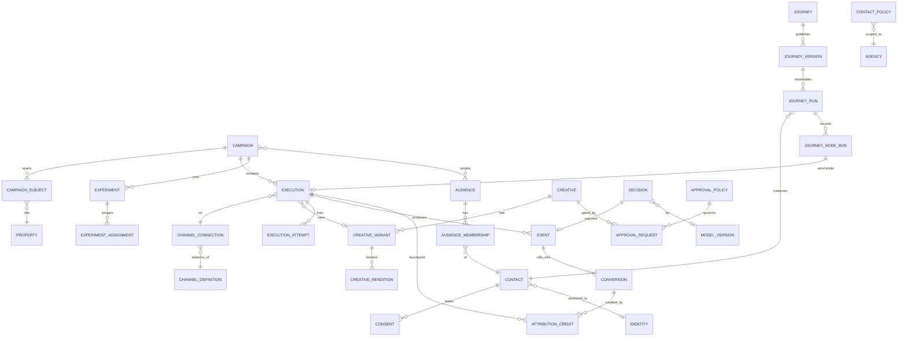

# D15 — Canonical Object Model (WingCaster Growth OS) — v2

**Status:** Draft spec — the contract every campaign/journey/publishing/AI workstream builds against.
**Date:** 2026-09-19 · **Revision:** v2 (incorporates external architecture review)
**Purpose:** Define the shared domain objects — identity, relationships, lifecycle, mapping to existing tables — **once**, so parallel agents build one contract instead of forking it, and we never repeat the reconciliation in `campaign-and-social-publishing-reconciliation.md`.

> **Model ≠ build.** Adding an object to this contract is cheap and prevents expensive retrofits — that is the whole point of D15. It does **not** mean the object ships at full depth for go-live (2026-09-30). Each object below is tagged **[L]** launch-depth or **[FF]** fast-follow depth. The *schema/contract* for both should land now; the *behaviour* is phased.

---

## v2 changelog (from the review)

| Change | Action |
|---|---|
| `CampaignSubject` associative object (N subjects/campaign) | **Added** (role kept; weight optional) |
| `journey` removed from `Execution.kind`; nodes emit Executions | **Changed** — added `message` delivery kind |
| `JourneyVersion` · `JourneyNodeRun` · `JourneyTransition` | **Added** |
| `Identity` anchor + `AudienceMembership` | **Added** (identity *resolution* engine deferred) |
| `Consent` / `CommunicationPreference` | **Added — launch-critical** |
| `Creative → CreativeVariant → CreativeRendition` | **Split** into three |
| `ChannelDefinition` / `ChannelConnection` | **Split** |
| `Event` hardening (idempotency, schema_version, category, correlation/causation) | **Applied** |
| `AttributionCredit` separate from `Conversion` | **Added**; removed authoritative `primary_execution_id` |
| `ExperimentAssignment` | **Added** |
| `Approval` → `ApprovalPolicy` + `ApprovalRequest` | **Upgraded** |
| `ContactPolicy` / `PressurePolicy` | **Added** |
| `Decision` (AI decision ledger) | **Added** |
| `LearningRecord` | **Moved** core → analytics/ML layer |
| Simulation / Dry-Run | **Added as a capability** (function over the model, not an object) |
| `Objective` as a separate object | **Rejected** (over-normalization; stays an enum on Campaign) |

---

## 0. Conventions (unchanged from v1)
TEXT `uuidv4()` PKs (prefixed) · mandatory `agency_id`/`agent_id` tenancy with Postgres **RLS** · `created_at`/`updated_at`/explicit lifecycle stamps · `deleted_at` soft delete on authored objects · `data JSONB` escape hatch for non-predicate attributes only · status enums extended via **their own tiny migration that lands first** · money as `amount_micros BIGINT` + `currency` · mutations write `audit_log`. `Property`/`Contact`/`Agent`/`Agency` already exist and are **referenced, not redefined**.

---

## 1. Object catalog (grouped)

Legend — **Maps to:** ✅ exists · 🔧 refactor · 🆕 new. **Depth:** [L] launch · [FF] fast-follow.

### A. Tenancy / Identity / Consent
- **Agency, Agent, Contact** — ✅ existing, referenced.
- **Identity** 🆕 [FF] — the future anchor tying a Contact's channel handles (email/phone/WhatsApp/social/anon-web) to one human. Fields: `id · primary_contact_id · handles(JSONB) · confidence`. **Launch:** `Contact` remains the operational entity; `Identity` exists as a nullable anchor so attribution has somewhere to converge later. **Deferred:** the resolution/merge engine.
- **Consent / CommunicationPreference** 🆕 **[L] launch-critical** — person × purpose × channel × jurisdiction state.
  `id · contact_id · channel(email/sms/whatsapp/…) · purpose(marketing/transactional/nurture) · status(granted/denied/withdrawn) · legal_basis · source · captured_at · expires_at · jurisdiction · proof_ref`.
  **Every Execution and every Journey `send` node checks Consent before dispatch.** Without this we cannot send compliant marketing (GDPR/PECR/CAN-SPAM/WhatsApp opt-in).

### B. Real-estate domain
- **Property** ✅, **Development / Portfolio** 🆕/✅ (verify existing) — subjects a campaign can target.

### C. Campaign domain
- **Campaign** 🆕 [L shell / FF depth] — the umbrella (optional per P1). Fields as v1 (objective enum · business_kpi · audience_ids · geography · funnel_stage · budget · owner · approval_state · attribution_model · status · lifecycle) **minus** the single `subject_type/subject_id` (moved to CampaignSubject). Rollups (leads→…→commission→ROI) are **derived** from Events/Conversions.
- **CampaignSubject** 🆕 [L] — associative: `campaign_id · subject_type(property/development/portfolio/agency) · subject_id · role(primary/promoted/supporting) · data(weight?)`. `Campaign → N CampaignSubject`.
- **Audience** 🔧 [L] — `id · type(static/dynamic) · rules(JSONB) · member_source(crm/followers/lookalike/uploaded) · estimated_size · data(AI provenance)`.
- **AudienceMembership** 🆕 [L basic / FF rich] — `audience_id · contact_id · state(matched/contactable/frequency_capped/opted_out/conflicting) · qualified_at · expires_at · inclusion(include/exclude)`. Turns "184 look relevant" into "184 matched / 151 contactable / 22 capped / 7 opted-out / 4 conflicting."

### D. Orchestration
- **Journey** 🔧 [L] — definition: `id · trigger · entry_audience_id · goal_event · suppression · status`. The mutable working copy.
- **JourneyVersion** 🆕 [L] — immutable published definition (`journey_id · version · graph(JSONB node/edge DAG) · published_at`). **Runs pin a version.**
- **JourneyRun** 🆕 [L] — a contact's traversal: `id · journey_version_id · contact_id · current_node_id · state(JSONB) · status(active/completed/exited/suppressed) · entered_at · exited_at`.
- **JourneyNodeRun** 🆕 [L record / FF analytics] — per-node record: `id · journey_run_id · node_id · node_type · input · result · execution_id? · occurred_at`. (High write-volume; may async/sample at scale.)
- **JourneyTransition** 🆕 [FF] — `journey_run_id · from_node · to_node · reason(condition result / experiment allocation)`. Gives the "why did the AI send this" trace.
- **Execution** 🆕 [L] — the unifying delivery object (replaces `distributions`/`distribution_jobs`/`publishing_jobs`/`scheduled_publications`). **`kind = message · social_post · paid_ad · portal_submit · seo_page`** (journey removed). `campaign_id?` (nullable, P1) · `journey_node_run_id?` (when emitted by a journey) · `channel_connection_id` · `creative_id?` · `audience_id?` · `scheduled_at?` · `recurrence` · `status(draft/scheduled/in_review/queued/processing/published/failed/cancelled)` · `provider_ref` · lifecycle stamps.
- **ExecutionAttempt** 🔧 [L] — = today's `distribution_attempts`. Per-try status/response/error-class.
- Node node-types (in `graph`): `trigger · wait · send · condition · branch · lead_score · goal · exit · experiment`. Only `send` emits an Execution.

### E. Channel
- **ChannelDefinition** 🆕 [L] — the platform: `id · platform · kind(owned_messaging/organic_social/paid/portal) · global_capabilities(formats, insights, scheduling)`.
- **ChannelConnection** 🔧 [L] — the tenant's connected account (unifies `platform_accounts` + `marketplace_connections`): `id · channel_definition_id · agency_id/agent_id · integration_model(enterprise_env/tenant_oauth) · credentials_ref · provider_account_id · rate_limits · health(connected/expired/error) · tenant_capabilities`.

### F. Content
- **Template** ✅ [L] — message templates (`platform_message_templates`) + creative templates (`social-cards`), one documented concept, two `kind`s.
- **Creative** 🆕 [L] — the concept: `id · subject_ref · source(manual/ai) · approval_state · status`.
- **CreativeVariant** 🆕 [L] — a creative angle: `id · creative_id · label(lifestyle/yield/price-led) · copy(JSONB per-channel) · experiment_id?`. (The ≥4 AI composer options are variants.)
- **CreativeRendition** 🆕 [L] — a concrete render: `id · creative_variant_id · channel_key · dimensions · provider(bannerbear/local) · asset_url · status`. **Rendition-level metrics** enable "concept good, but 9:16 outperforms static feed."
- Rendered via the **Creative Asset Service** (Bannerbear = one interchangeable renderer).

### G. Governance
- **ApprovalPolicy** 🆕 [FF] — `id · applies_to(creative/campaign/execution/channel) · conditions(e.g. ai_generated AND public) · reviewers · sequence(sequential/parallel) · sla · allow_self_approval(false)`.
- **ApprovalRequest** 🆕 [L subset] — `id · policy_id? · subject_ref · subject_version · requested_by · state(pending/approved/rejected) · reviewers · decision_history(JSONB) · created_at`. **Launch:** a single hardcoded policy = "AI-generated public content requires human approval."
- **ContactPolicy / PressurePolicy** 🆕 [L caps / FF conflict] — global decision layer: `id · scope(agency/agent) · rules(JSONB: frequency caps, quiet hours, do-not-contact windows, campaign-priority, negotiation suppression)`. Checked by every Execution alongside Consent. **Launch:** frequency caps + do-not-contact. **FF:** cross-campaign conflict resolution / priority.

### H. Measurement
- **Event** 🆕 **[L]** — the append-only spine. Hardened:
  `id · event_name · event_category(business/delivery/engagement/system) · schema_version · source · actor · object_ref · context(JSONB) · occurred_at · ingested_at · contact_id? · execution_id? · campaign_id?(denorm) · channel_connection_id? · value_micros?/currency? · provider_event_id (idempotency_key, UNIQUE) · correlation_id · causation_event_id?`.
  Idempotency `UNIQUE(provider_event_id)` prevents double-counting on webhook retries. `correlation_id`/`causation_event_id` reconstruct the causal chain (recommendation → campaign → execution → impression → lead → viewing → transaction).
- **Conversion** 🆕 [L] — the business transition, attribution-neutral: `id · contact_id · from_stage · to_stage · occurred_at · value_micros`. **No authoritative primary execution.**
- **AttributionCredit** 🆕 [L basic / FF data-driven] — `id · conversion_id · execution_id(touchpoint) · model(last/first/linear/position/data_driven) · credit_weight`. Multiple rows per conversion per model; re-runnable without touching Conversion.
- **Experiment** 🆕 [FF] — `id · campaign_id? · dimension(creative/copy/cta/channel/timing/journey_path) · variants · allocation(even/bandit) · holdout_pct · goal_event · status · result`.
- **ExperimentAssignment** 🆕 [FF] — `id · experiment_id · contact_id · variant · assigned_at · assignment_reason · model_version`. Reproducibility under dynamic/AI allocation.

### I. Intelligence
- **Decision** 🆕 **[FF — strategically decisive]** — the AI decision ledger, for **consequential** decisions only (channel/timing/audience/variant/spend, not micro-inferences):
  `id · decision_type · subject_ref(contact/campaign/execution) · context_snapshot(JSONB) · candidate_actions(JSONB) · selected_action · model · model_version · confidence · reason_codes(JSONB) · policy_constraints(JSONB) · human_override · created_at · outcome_event_id?`.
  Closes the **decision → action → outcome** loop that lets WingCaster learn "given this property/market/buyer/agent/moment, what is the next best commercial action?"
- **Recommendation** 🆕 [FF] — a proposed (not yet executed) Decision surfaced to a human (`= Decision with state pending_human`).
- **ModelVersion** 🆕 [FF] — registry: `id · model · version · trained_at · metrics`. Referenced by Decision/ExperimentAssignment for reproducibility.

### J. Analytics / ML (derived — NOT core transactional)
- **LearningDataset / FeatureStore / OutcomeModel** 🆕 [FF] — derived from Event + Decision + ExperimentAssignment + Conversion + AttributionCredit. This is where the old `LearningRecord` lives, kept **reproducible from authoritative facts** (no parallel truth).

---

## 2. Relationship map (v2)

---

## 3. Lifecycles
- **Campaign:** draft → (approved) → scheduled → active → paused ↔ active → completed → archived.
- **Execution:** draft → scheduled → in_review* → queued → processing → published | failed → (retry) queued. *only when an ApprovalRequest/portal review applies.
- **JourneyRun:** active → completed | exited | suppressed.
- **Creative:** draft → pending* → ready → published → archived. *only when approval required.
- **ApprovalRequest:** pending → approved | rejected.
- **Experiment:** draft → running → concluded.

## 4. Cross-cutting capabilities (functions over the model, not objects)
- **Eligibility check** [L] — every dispatch runs `Consent ∧ ContactPolicy ∧ ChannelConnection.health` before send.
- **Dry-Run / Simulation** [FF] — pre-activation report over the model: eligible / consent-suppressed / frequency-suppressed / conflicting-journeys / expected sends / est. cost / missing creative / expired connections. Enabled by Consent + ContactPolicy + AudienceMembership.

## 5. Mapping to existing schema
| Canonical | Existing | Action |
|---|---|---|
| Execution (+attempts) | `distributions`, `distribution_jobs`, `publishing_jobs`, `scheduled_publications`, `distribution_attempts` | Consolidate → `executions` + `execution_attempts`; back old names with views during cutover |
| Journey/Version/Run/NodeRun | `campaigns` + steps | Rename + version + runtime tables |
| Audience/Membership | inline `audience_rules`/`tags_filter` | Extract |
| Creative/Variant/Rendition | `social-cards` + `media_urls` | New over Creative Asset Service |
| ChannelDefinition/Connection | `platform_accounts` + `marketplace_connections` | Split + unify |
| Consent | — (partial opt-out flags scattered) | New canonical; migrate any existing opt-out flags |
| Event/Conversion/AttributionCredit | `logActivity`, distribution counters, insights | New `events`(partitioned) + `conversions` + `attribution_credits` |
| Decision/ModelVersion/Experiment* | — | New |

**Migration discipline:** shared `CHECK`/enum additions ship as their own tiny first-landing migration; consolidations ship behind views so parallel Real-PG CI doesn't break.

## 6. Open questions
1. Portal `submit-to-fi` as `Execution(kind=portal_submit, status=in_review)` vs a distinct review sub-machine — recommend same object.
2. SEO as `Execution(kind=seo_page)` for the *act*; the page itself on Property/Bazaar.
3. Commission `value_micros` on transaction Events — source of truth is the finance ledger; define the read/attest boundary.
4. Event partitioning + retention; which provider metrics are Events vs periodic snapshots.
5. Identity resolution ownership + Bazaar boundary (anonymous web visitor → Contact).
